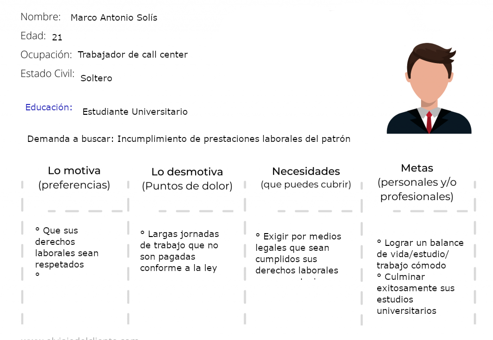

# Practicas semana 1 - launchX UI/UX
## Actividad: Abogabot

**Descripción:**
- Es un despacho de abogados que quiere automatizar las demandas de sus clientes, esto lo harán a traves de una página web llenando un formulario.
- Al momento de llenar el formulario se manda al proceso de pago para finalizar la transacción.
- Para dar seguimiento a su demanda, el cliente crea una cuenta en la plataforma y verá el seguimiento de cada una de las actualizaciones del proceso legal.
- El administrador del sitio recbe la notificación de una nueva demanda y con los datos llenados del formulario se crea automaticamente el documento  legal en formato word para empezar el proceso.
- El administrador recibe el pago y debe de ser capaz de verlo en un dashboard para ver la cantidad de ingresos recibidos.
- El administrador actualiza el proceso de la demanda y agrega comentarios en cada paso del proceso.
- Al usuario le llegan correos de notificación para saber el avance de su proceso.
- La página debe de ser responsive para poderla ver desde el celular.
- La preferncia de colores del cliente es azul marino y blanco, pero acepta propuestas.

---
## Entregables:
  - [Toma de requerimientos](./1.-Requerimientos.doc)
  - Buyer persona:
  
  - Público Objetivo
  
  - Wireframe del sistema: https://www.figma.com/file/PRWyjRQqMVzmOlZ82xHgnu/Abogabot?node-id=0%3A1 
  - UI del sistema: https://www.figma.com/file/iUCNE0Fe788CkOgpZEN39P/Abogabot-UI?node-id=0%3A1
